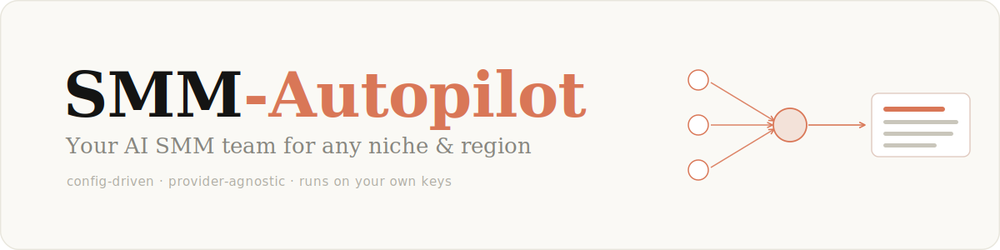
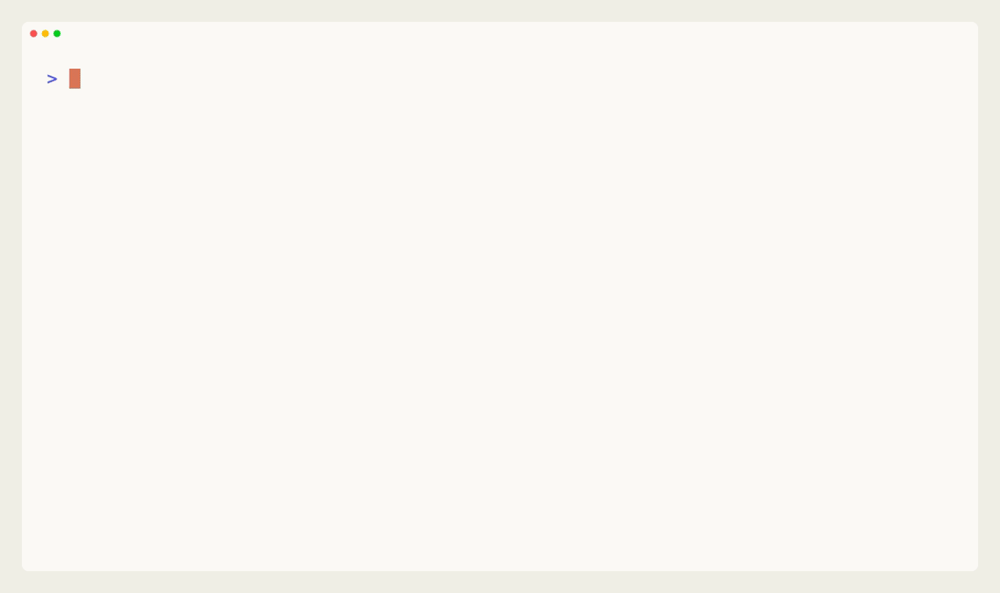
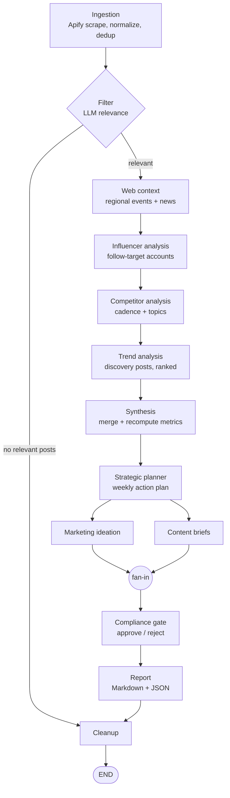

<div align="center">



SMM-Autopilot turns public Instagram data into a weekly social-media strategy report.
You configure it for a brand once; it scrapes, analyzes, and writes the report, with every
figure recomputed from real posts rather than generated by the model.

[](https://github.com/maxrihter/smm-autopilot/actions/workflows/ci.yml)

[](https://github.com/langchain-ai/langgraph)
[](LICENSE)
[](pyproject.toml)
[](https://github.com/astral-sh/ruff)
[](https://mypy-lang.org/)

</div>

---

## Overview

Social strategy depends on research, and the research is the slow part. Each week someone
reviews competitors, works out which formats are gaining traction, accounts for upcoming
regional events, and turns the result into briefs the content team can produce. By the time
that is done, the trend has usually passed. Generic "AI caption" tools do not help here: they
fabricate engagement numbers and have no view of a specific niche in a specific week.

SMM-Autopilot runs that research as a multi-agent pipeline. You describe the brand once in a
YAML file: niche, competitors, region, and the accounts worth watching. The engine scrapes
the relevant posts, analyzes them, and produces a single report covering trends, competitor
activity, breakout posts, content briefs, and a prioritized action plan. Every metric in the
report is recomputed from the scraped posts; the model interprets the data, it does not
supply the numbers.

The project is the generalized form of a system I ran in production for a client. The
architecture, resilience model, and recompute logic are unchanged. The client's data, names,
and strategy were removed and replaced with a fictional example tenant: a US dog-food brand
called Barkwell.

## Quickstart

The demo runs the entire pipeline on bundled fixtures, with no API keys and no network access.

```bash
git clone https://github.com/maxrihter/smm-autopilot && cd smm-autopilot
make install      # uv sync --extra dev
make demo         # full pipeline on fixtures; no keys, no network
```

It writes `output/demo.md`, a complete report:

<div align="center">

</div>

Swap Barkwell for your own brand and the report follows; see [Configuration](#configuration).
The full committed sample is in [docs/sample-report.md](docs/sample-report.md).

## How it works



Posts are ingested and filtered for relevance, then analyzed in four stages: regional context
(events and news), influencer signal, competitor cadence, and discovery trends. Synthesis
merges these into a ranked picture; the strategy, briefs, and ideas are generated from it; and
a compliance gate reviews every item before it reaches the report.

1. Ingest. Pull Instagram posts via Apify (discovery hashtags, competitor profiles, tracked
   creators), then normalize and deduplicate against previous runs.
2. Filter. An LLM keeps only posts relevant to the niche. If none qualify, the run stops
   cleanly and still purges the scraped data.
3. Analyze. The four lenses run in sequence, which keeps the pipeline within LLM rate limits.
4. Synthesize. Merge the lenses into a ranked picture, recomputing every metric from the real
   posts and discarding any post URL the model invents.
5. Generate. The action plan, content briefs, and marketing ideas are produced in parallel.
6. Gate. The compliance node checks each brief and idea against the configured safety and
   brand rules; only approved items continue.
7. Report. One Markdown and JSON deliverable, after which the scraped data is removed.

A few design decisions worth noting:

- Model output is treated as structure, not fact. Metrics are recomputed from the scraped
  posts, and enriched items are matched back to their source by identity rather than list
  position, so a reordered response cannot attach data to the wrong trend.
- Parallel branches write to separate state keys, which avoids reducers and locks; a fan-in
  barrier ensures the compliance gate runs exactly once.
- Each role follows a `primary → retry → fallback → fail-open` chain, so a single empty or
  malformed response degrades gracefully instead of failing the run.

The node-by-node design is documented in [docs/ARCHITECTURE.md](docs/ARCHITECTURE.md).

## Features

- Configurable for any niche or region. Brand, competitors, keywords, and events live in one
  `tenant.yaml`; retargeting requires no code changes.
- One report across several lenses: trends, competitors, creator signal, regional events and
  news, strategy, and content.
- Metrics grounded in real data. Engagement, reach, and trend scores are recomputed from the
  scraped posts; fabricated URLs are discarded.
- Provider-agnostic routing. Anthropic and any OpenAI-compatible endpoint (OpenAI, a local
  Ollama, imago.market) are built in; Mistral and Google are optional extras.
- Resilient model calls. A per-role `primary → retry → fallback → fail-open` chain means one
  bad response does not fail the batch.
- Compliance gate. Every brief and idea is checked against configurable safety and brand rules
  before it ships.
- Local-first storage. SQLite by default (deduplication and run-over-run deltas), Postgres
  optional. Data stays on your machine.

## How it compares

| | A human team or agency | Generic AI caption tool | SMM-Autopilot |
|---|---|---|---|
| Niche and region signal, current week | Yes, gathered by hand | No | Yes, scraped each run |
| Engagement figures | Real, pulled manually | Invented | Recomputed from real posts |
| Competitor and creator intel | Yes, manual | No | Yes, automated |
| Output | Strategy, briefs, and production | A caption | Weekly report, briefs, and an action plan |
| Cost | High: retainer or salaries | Low and flat | API and scraping usage only |
| Scaling to more brands or regions | Hire more people | Not applicable | Add a config file |
| Management overhead | Hiring, onboarding, oversight, turnover | None | None; runs unattended |
| Data and control | Their tools and dashboards | Their servers | Your machine, your keys |

SMM-Autopilot covers the research and drafting layer, not the whole job. A person still owns
creative direction, brand relationships, and production; the engine makes sure they start each
week with that groundwork already done.

## Configuration

```bash
make init            # scaffolds config/tenant.yaml from the bundled example
$EDITOR config/tenant.yaml
```

A tenant is plain data:

```yaml
brand:
  name: Your Brand
  region: US                       # drives the regional events and news lens
  content_language: English        # language of the briefs and ideas
  report_language: English         # language of the report prose
  tone: "Warm, playful. Soft CTAs. Never fear-based."
  ctas: [Shop now, Learn more]
  forbidden_keywords: [cure, guaranteed]

niche:
  topic_whitelist: [product, education, community]
  keywords_l1: [your core keyword, another core term]   # direct niche signal
  hashtags:
    core: ["#yourniche", "#relatedtag"]

region:
  timezone: America/New_York
  events:
    - name: Your seasonal moment
      month: 10
      day: 1
      social_potential: high
      window_days: 30
  news_feeds: ["https://example.com/feed/"]

competitors:
  - { name: Competitor One, instagram_url: https://instagram.com/competitor_one/ }
discovery_targets:                 # creator accounts to mine for formats
  - { name: Creator One, instagram_url: https://instagram.com/creator_one/ }

llm:                               # per-role model routing, inline (no separate file)
  analyst:
    primary: { provider: anthropic, model: claude-sonnet-4-6 }
```

Every field is documented in [docs/CONFIGURATION.md](docs/CONFIGURATION.md). The prompts in
`src/smm_autopilot/prompts/*.txt` use `# ADD: your …` comments to mark what to tailor per
vertical.

## Running live

A live run scrapes real Instagram data:

```bash
cp .env.example .env     # add APIFY_TOKEN and one LLM key
make run                 # writes output/<run_id>.md and .json
```

It requires an [Apify](https://apify.com) token and one LLM key for the provider in your
`llm:` block. For reliable scraping you will also want a warmed Instagram account behind an
anti-detect browser. The operational playbook is in [docs/SETUP.md](docs/SETUP.md).

## Extending

Most additions are a node, a prompt, and one edge; the engine does not need to be forked.

- New data source: add a scraper or loader and feed it into ingestion.
- New output: add an adapter in `integrations/output/`. Markdown and JSON ship today; Sheets
  and Telegram are optional extras.
- New analysis lens: add a node and prompt, then wire one edge in `engine/graph.py`.
- New LLM provider: point the router at any OpenAI-compatible endpoint via config, with no
  code change.

Details are in [docs/EXTENDING.md](docs/EXTENDING.md).

## Architecture

```
smm-autopilot/
├── src/smm_autopilot/
│   ├── cli.py                 # init / run / demo / version
│   ├── config.py              # tenant settings (brand, niche, region, thresholds)
│   ├── engine/
│   │   ├── graph.py           # LangGraph wiring (13 nodes)
│   │   ├── pipeline.py        # entrypoint and dependency injection
│   │   ├── demo.py            # hermetic, no-keys demo
│   │   └── nodes/             # one node per stage (ingestion … report)
│   ├── llm/router.py          # provider-agnostic, resilient LLM router
│   ├── models/                # Pydantic v2 schemas
│   ├── prompts/               # system prompts (.txt, with `# ADD:` comments)
│   ├── templates/             # bundled example tenant (Barkwell)
│   └── storage/               # SQLite store and checkpointer
├── docs/                      # SETUP, CONFIGURATION, EXTENDING, ARCHITECTURE
└── tests/                     # 51 mocked tests, no keys required
```

| Layer | Technology | Notes |
|---|---|---|
| Orchestration | LangGraph | typed multi-node graph, fan-in barrier, checkpointing |
| LLM access | LangChain core and provider SDKs | one router, multiple providers, structured Pydantic output |
| Data models | Pydantic v2 | lenient, validated schemas |
| Scraping | Apify | managed Instagram actors (profiles, hashtags) |
| Storage | SQLite / Postgres | deduplication and run deltas, local-first |
| Regional news | feedparser | RSS for region-relevant news |
| CLI | Typer and Rich | init / run / demo / version |
| Tooling | uv, ruff, mypy, pytest | fast, typed, linted, tested |

## Security and data handling

- Metrics are recomputed from real posts and fabricated URLs are discarded during synthesis;
  the model does not supply figures.
- Briefs and ideas reach the report only after passing a configurable safety and brand-voice
  check.
- Secrets are read from `.env` only, and nothing sensitive is committed; `.env.example` ships
  empty placeholders.
- Scraped data is stored in a local SQLite database and removed after each run.
- The repository was generalized from a private system with all client data, names, and
  strategy removed. The only brand present is the fictional Barkwell.

## Development

```bash
make install     # uv sync --extra dev
make test        # pytest -q; 51 tests, no keys required
make lint        # ruff check and mypy
make fmt         # ruff format and autofix
```

Python 3.11+, fully typed, async I/O throughout. The test suite is mocked and runs offline.

## Documentation

| Document | Contents |
|---|---|
| [SETUP.md](docs/SETUP.md) | Live-run playbook: warmed account, anti-detect browser, Apify, cookies |
| [CONFIGURATION.md](docs/CONFIGURATION.md) | Every `tenant.yaml` field: brand, niche, region, thresholds, LLM routing |
| [EXTENDING.md](docs/EXTENDING.md) | Adding a source, output, analysis lens, or LLM provider |
| [ARCHITECTURE.md](docs/ARCHITECTURE.md) | Node-by-node design, resilience, and the recompute model |

## Author

I build production multi-agent LLM systems. SMM-Autopilot is the open-source generalization of
one of them. More of my work is on [GitHub](https://github.com/maxrihter), including
[imago](https://imago.market), an LLM marketplace. Available for AI and LLM consulting.

## Contributing

Issues and pull requests are welcome; see [CONTRIBUTING.md](CONTRIBUTING.md). Run
`make lint && make test` before opening a pull request.

## License

[MIT](LICENSE) © Max Romanov
