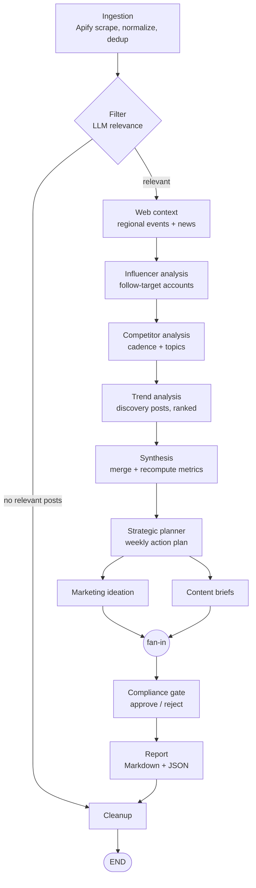

# Architecture

SMM-Autopilot is a [LangGraph](https://github.com/langchain-ai/langgraph) state machine: a typed
`PipelineState` flows through 13 nodes, each a single `async` function in
[`engine/nodes/`](../src/smm_autopilot/engine/nodes/). Dependencies (`settings`, `router`, `store`)
are bound at build time with `functools.partial` in
[`engine/graph.py`](../src/smm_autopilot/engine/graph.py); nodes never read globals.



## Design principles

- **Config-driven, never hardcoded.** Brand/region/vertical live in `tenant.yaml`; the code is generic.
- **Ground truth over generation.** The model interprets the data; it never supplies metrics. Every
  number is recomputed from scraped posts, and fabricated post URLs are dropped.
- **Fail soft, not silent.** A short or empty LLM reply triggers a fallback/retry, not a crashed run.
- **Sequential analysis, parallel creation.** The analysis chain runs in series to stay gentle on
  rate limits; only the content/ideation pair fans out.

---

## The pipeline, node by node

| # | Node | Role | What it does |
|---|---|---|---|
| 1 | `ingestion` | — | Fetches each Apify dataset, normalizes posts, **de-duplicates** against the Store, and caps volume at `max_posts_per_run`. |
| 2 | `filter` | filter | LLM keeps only niche-relevant posts. If none remain, sets `pipeline_status="empty_filter"` and the graph routes straight to cleanup. |
| 3 | `web_context` | — | Computes upcoming events (`EventConfig.next_occurrence`) and pulls region news via RSS. No LLM, no keys. |
| 4 | `influencer_analyzer` | analyst | Mines `discovery_targets` posts for viral formats; diversifies so one account can't dominate the digest. |
| 5 | `competitor_analyzer` | analyst | Posting cadence, topic mix, and top posts, built from real data rather than the model's guess. |
| 6 | `trend_analyzer` | analyst | Clusters discovery posts into ranked trends; recomputes ER/reach, drops fake URLs, applies dual (niche + context) ranking. |
| 7 | `synthesis` | analyst | Merges the lenses into one ranked picture and **re-attaches metrics by title** (not list index). |
| 8 | `strategic_planner` | analyst | A prioritized weekly action plan from the synthesized signal. |
| 9 | `marketing_ideation` | analyst | Repeatable campaign/format ideas. *(fans out from #8)* |
| 10 | `content` | analyst | Shootable content briefs (hook / body / CTA / hashtags). *(fans out from #8)* |
| — | `content_barrier` | — | Fan-in barrier (inline in `graph.py`) so compliance runs **exactly once** after both ideation (#9) and content (#10). |
| 11 | `compliance` | compliance | Checks every brief and idea against safety + brand rules; only approved items pass. |
| 12 | `report` | — | Renders Markdown + JSON to `output/<run_id>.*`. |
| 13 | `cleanup` | — | Marks the run done; datasets are already purged at fetch time (runs on success *and* on abort). |

---

## Resilience: the LLM router

[`llm/router.py`](../src/smm_autopilot/llm/router.py) exposes one method the nodes call,
`call_resilient(role, schema, messages, *, nonempty, retry_hint)`, which walks an escalation ladder:

```
primary  →  (empty? retry with hint)  →  fallback  →  (empty? retry with hint)  →  None
```

- **Per-role routing.** `filter` / `analyst` / `compliance` map to their own primary+fallback.
- **Transient-aware.** `is_transient_error` distinguishes capacity/timeout errors (worth a fallback)
  from genuine bad requests (not).
- **Structured outputs.** Every call returns a validated Pydantic object via `get_structured`.
- **Fail-open.** If everything comes back empty, `call_resilient` returns `None` and the node degrades
  gracefully (e.g. skips that section) instead of throwing.

Because schemas are **lenient** (see below), one malformed item in a batch never fails the whole call.

---

## Ground-truth recompute

LLMs interpret posts well and recall numbers badly, so the analysis nodes treat model output as
structure only:

- **Metrics are recomputed** from the real post objects via [`engine/metrics.py`](../src/smm_autopilot/engine/metrics.py)
  (`compute_er`, `post_reach`); the model's claimed ER and views are discarded.
- **Fabricated URLs are dropped.** A trend's `example_posts` are intersected with the set of URLs that
  were actually scraped; invented links disappear and `post_count` reflects what survived.
- **Re-attach by identity, not order.** When a node enriches items, results are matched back to the
  originals by title (`synthesis._restore_metrics`), so a reordered response cannot move metrics onto
  the wrong trend.
- **Trend score** is a transparent weighted blend (engagement 0.40 · reach 0.35 · diversity 0.25),
  computed in the model layer, not by the LLM.

---

## Lenient schemas

Pydantic models in [`models/`](../src/smm_autopilot/models/) default every field, so a bare `{}`
parses and a single short brief never raises. Nodes then drop empties after parsing, so one weak item
is filtered rather than fatal to the batch. This is what makes "fail soft" hold under real, imperfect
model output.

---

## State & concurrency

`PipelineState` is a `TypedDict`. The parallel branches (#9 ideation, #10 content) write to different
keys, so no reducers or locks are needed, and the `content_barrier` join guarantees the compliance
node observes both before it runs. The graph is checkpointed in-memory within a run
(`thread_id = run_id`); swap in a durable saver (SQLite/Postgres) to resume across restarts.

---

## Storage

[`storage/store.py`](../src/smm_autopilot/storage/store.py) is a SQLite store that powers **dedup and
run-over-run deltas**; [`storage/checkpoint.py`](../src/smm_autopilot/storage/checkpoint.py) provides
an in-memory LangGraph checkpointer (local by default, `./data/state.db`). A `postgres` install extra
is provided for swapping both out when you outgrow SQLite. The pipeline owns the store's lifecycle
unless one is injected (as the demo does with an in-memory store).

---

## Demo mode (hermetic)

[`engine/demo.py`](../src/smm_autopilot/engine/demo.py) runs the **entire real graph** with two swaps:

- a `DemoRouter` subclass returns canned structured outputs instead of calling an LLM, and
- `fetch_dataset` is patched to serve synthetic fixtures instead of hitting Apify.

News feeds are cleared and an in-memory store is used, so `make demo` needs no API keys and touches no
network. It is the same code path a live run takes, which makes it both a showcase and an end-to-end
test.
